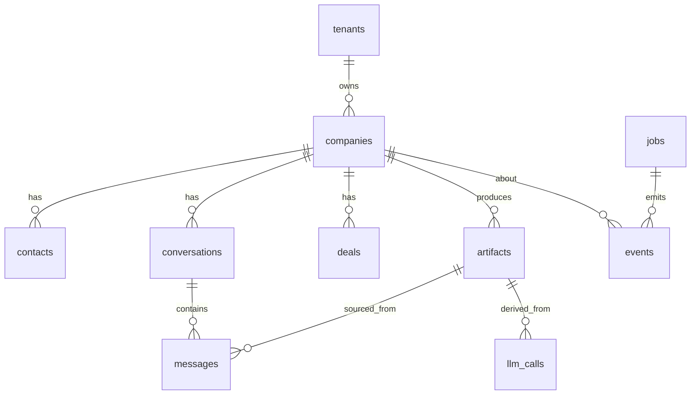

# ER Diagram

```
                          ┌──────────┐
                          │ tenants  │
                          └────┬─────┘
                               │ 1..*
                               ▼
                       ┌───────────────┐
                       │   companies   │◄──────────────┐
                       └────┬──────────┘                │
                            │                           │
                ┌───────────┼───────────┐              │
                ▼           ▼           ▼              │
            ┌────────┐  ┌────────────┐  ┌────────┐    │
            │contacts│  │conversations│  │ deals  │    │
            └────────┘  └─────┬──────┘  └────────┘    │
                              │                         │
                              ▼                         │
                         ┌────────┐                     │
                         │messages│                     │
                         └───┬────┘                     │
                             │                          │
                             ▼ artifact_id (optional)   │
                       ┌──────────────┐                 │
                       │  artifacts   │                 │
                       └──────┬───────┘                 │
                              │                          │
                              ▼                          │
                       ┌──────────────┐                  │
                       │  llm_calls   │                  │
                       └──────────────┘                  │
                                                         │
        ┌──────┐ correlation_id ─► ┌──────────┐         │
        │ jobs │ ─────────────────►│  events  │─────────┘ company_id
        └──────┘                   └──────────┘
                                         ▲
                                         │
                                 ┌───────┴───────┐
                                 │  saga_state   │
                                 └───────────────┘
```

(Render as Mermaid in Obsidian — placeholder ASCII for now.)



Links: [[schema]] · [[../02-architecture/database]]
